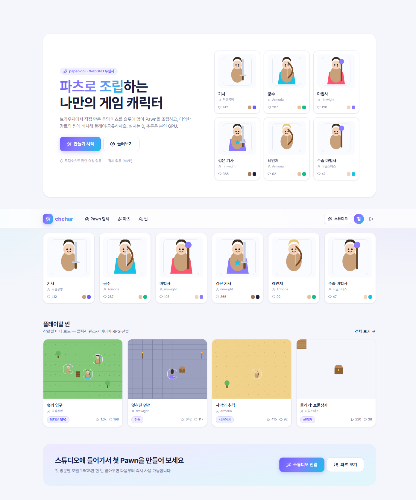
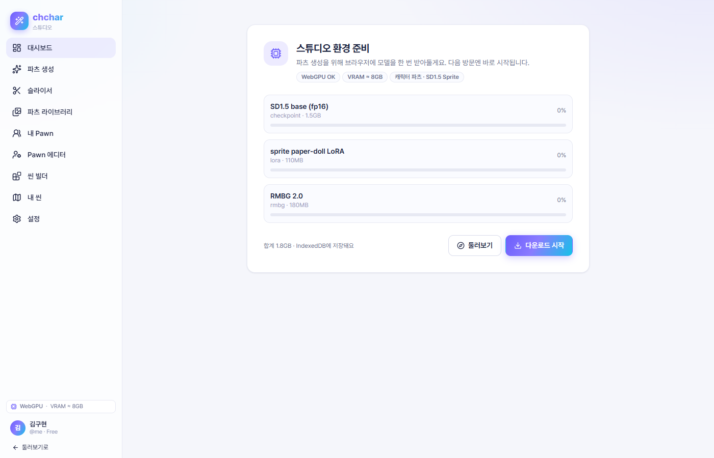
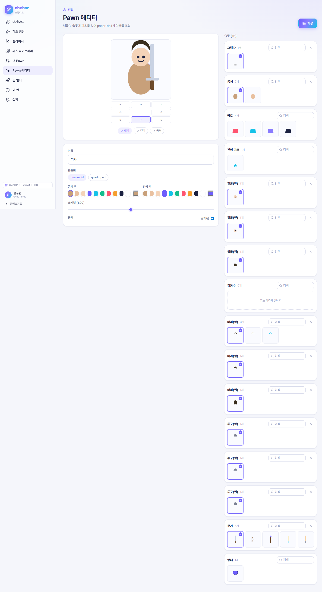
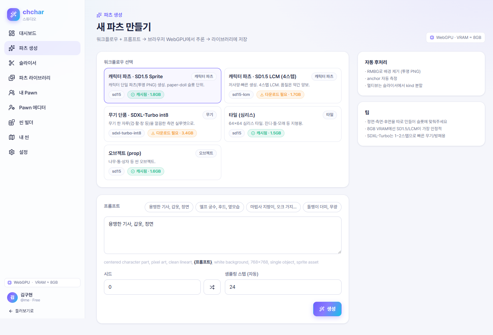
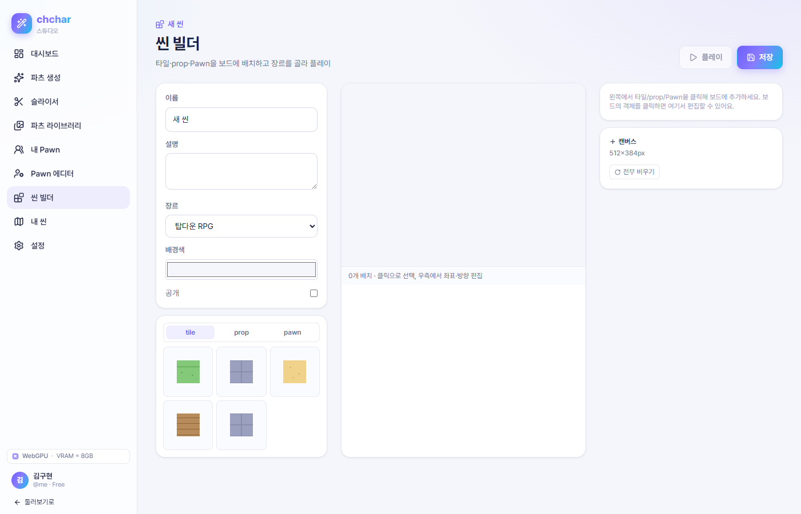
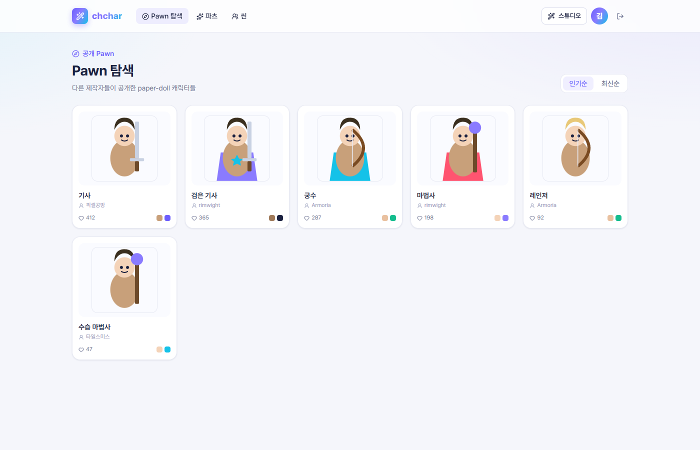
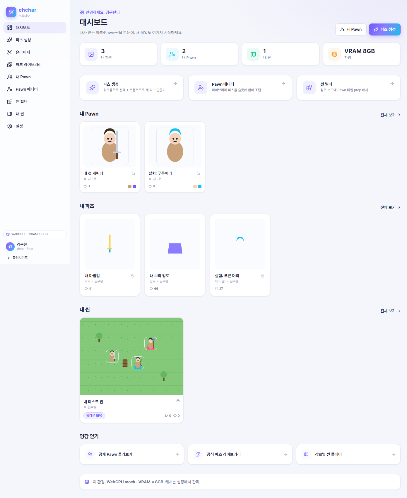
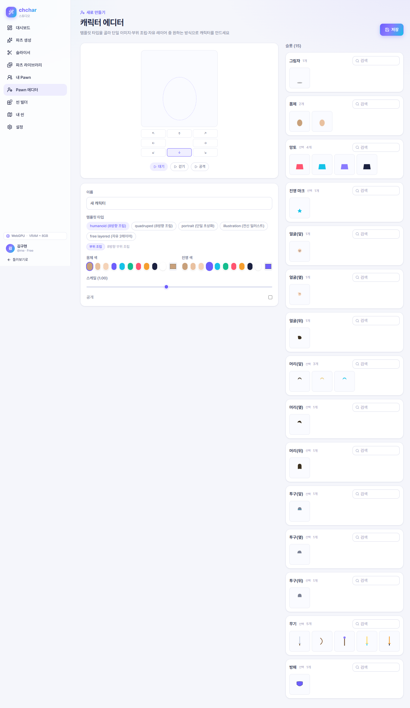
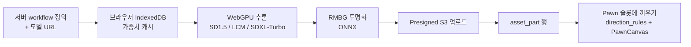

<div align="center">


### 🧩 파츠 조립형 paper-doll Pawn 크리에이티브 SaaS

투명 **파츠(atlas)** 를 슬롯에 끼워 **Pawn**(paper-doll 캐릭터)을 만드는 도구.
8방향 이미지를 따로 그리는 대신 **방향 규칙·좌표·스케일**로, 모션은 **코드**로 표현합니다.
**생성은 브라우저 WebGPU** (web-stable-diffusion / onnxruntime-web) — **무설치·즉시·내 PC에서**.

<br/>


</div>

---

## 주요 기능

- **WebGPU 인브라우저 추론** — SD1.5 / LCM / SDXL-Turbo 양자화 모델을 가중치 IndexedDB 캐시 후 브라우저에서 생성. 8GB VRAM 타깃.
- **파츠 atlas → Pawn 조립** — `pawn_template.direction_rules`(8방향) + 슬롯에 파츠를 끼워 한 캐릭터로 합성. 모션은 코드(`PawnCanvas`).
- **씬 빌더 5장르** — `scene.placements`에 pawn/tile/prop 좌표 → 클릭·디펜스·서바이버·탑다운RPG·전술 룰로 플레이.
- **공개 / 스튜디오 2영역** — 공개(탐색·플레이)는 WebGPU 0의존, 스튜디오(만들기)는 로그인+WebGPU 필요.
- **12-테이블 SQLModel ERD** — `user` / `workflow` / **`asset_part`** / **`pawn`** / **`pawn_template`** / `scene` / `like` / `comment` / `play_record` 등.
- **Studio Light 디자인 시스템** — Pretendard + 브랜드 그라데이션(보라→시안) + 라운드 14~16px + 소프트 섀도.

---

## 🖼️ 미리보기

| 랜딩 — 인기 Pawn·씬 | 스튜디오 온보딩 게이트 |
|:---:|:---:|
|  |  |
| **Pawn 에디터 — composite 슬롯** | **파츠 생성 — WebGPU GenerationProgress** |
|  |  |
| **씬 빌더 — 5장르 placements** | **탐색 — Pawn 그리드** |
|  |  |
| **대시보드 — 내 작업** | **에디터 — 합성 vs 단일** |
|  |  |

---

## 🔄 생성 흐름



조립: `pawn_template.slots` + 파츠 → `pawn.composition` 직렬화 → `PawnCanvas`가 방향·모션 재생.

---

## 🚀 빠른 시작

```bash
cd frontend
npm install
npm run dev      # http://localhost:5173
```

WebGPU 환경 강제 쿼리스트링: `?gpu=ok | no-webgpu | no-adapter`

---

## 🛠 기술 스택

| 영역 | 사용 기술 |
|---|---|
| **프런트** | React 19 · TypeScript · Vite 8 · Tailwind CSS v4 · framer-motion · Zustand · React Router 7 |
| **렌더 / 게임** | Phaser 4 · React Flow · 자체 `PawnCanvas` (2D 합성 + 코드 애니) |
| **WebGPU** | web-stable-diffusion / transformers.js / onnxruntime-web (계획) · IndexedDB 캐시 |
| **백엔드 모델** | SQLModel 12테이블 (MariaDB 대상, 참고용 — `backend/models.py`) |

---

## 📁 디렉토리 구조

```text
frontend/src/
├── App.tsx · main.tsx
├── layouts/        PublicLayout · StudioLayout
├── pages/
│   ├── public/     /, /explore, /pawn/:id, /scene/:id, /u/:handle
│   └── studio/     /studio/{onboarding,generate,slicer,parts,pawn,pawns,scene,settings}
├── components/    PawnCanvas · WebGpuGate · GenerationProgress · ModelCacheBadge · VramHud · SlotPicker · UnsupportedNotice · PartCard · PawnCard · SceneCard · SceneStage
├── ui/            Button · Card · Modal · PageHeader · Avatar · Badge · ColorSwatch · Stat · EmptyState · Toggle
├── lib/           webgpu · modelCache · pawnCompose · format
├── store/         studio (zustand)
└── mock/          parts · pawns · scenes · templates · users · workflows · svg · comments

backend/
├── models.py           SQLModel 12테이블 (MariaDB 대상)
├── ai_workflow/        ← 스캐폴드
├── game_engine/        ← 스캐폴드
└── storage/            ← 스캐폴드

docs/
├── ERD.md       서비스 DB v5 12테이블 ERD
├── SCREENS.md   전체 화면 설계 + DB 1:1 매핑
└── screens/     01~09 스크린샷

tools/
├── slice_sheet.py      atlas 시트 분할 (개발용)
└── assemble_4dir.py    4방향 합성 (개발용)
```

---

## ⚠️ 진행 상태 (목업 단계)

- **이 저장소는 화면(프론트엔드)만, 전부 목업 데이터로 동작** — 백엔드·WebGPU 추론·인증·스토리지 미연동.
- 파츠 = 플레이스홀더 SVG(`frontend/src/mock/svg.ts`), "생성" = `store/studio.ts`의 setTimeout 시뮬레이션, 모델 캐시 = localStorage 시뮬레이션.
- `backend/ai_workflow`, `game_engine`, `storage` 는 다음 스텝을 위한 빈 스캐폴드입니다.
- **7차 피벗**: 이전 GpuConnect / Queue / Pipeline 행을 제거하고 paper-doll Pawn + WebGPU 인브라우저로 전면 재설계.
- 다음 스텝: ① WebGPU 추론 PoC ② 백엔드(MariaDB·인증·CRUD·presigned URL).

<div align="center">


</div>
