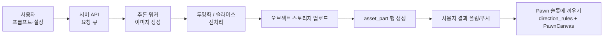

<div align="center">


### 🧩 파츠 조립형 paper-doll Pawn 크리에이티브 SaaS

투명 **파츠(atlas)** 를 슬롯에 끼워 **Pawn**(paper-doll 캐릭터)을 만드는 도구.
8방향 이미지를 따로 그리는 대신 **방향 규칙·좌표·스케일**로,
모션은 **코드**로 표현합니다. (RimWorld·Battle Brothers·Wildermyth·Armello 톤)

<br/>


</div>

---

## 주요 기능

- **파츠 atlas → Pawn 조립** — `pawn_template.direction_rules`(8방향) + 슬롯에 파츠를 끼워 한 캐릭터로 합성. 모션은 코드(`PawnCanvas`).
- **캐릭터 에디터 3타입** — `single`(단일 이미지) · `composite`(슬롯 + 색 + 8방향) · `layered`(자유 레이어). 한 에디터로 분기.
- **씬 빌더 5장르** — `scene.placements`에 pawn/tile/prop 좌표 → 클릭·디펜스·서바이버·탑다운RPG·전술 룰로 플레이.
- **파츠 생성은 서버 위임** — 사용자는 프롬프트만 요청. 서버가 추론·투명화·업로드까지 책임지고 결과 URL만 회신. (일반 SaaS 패턴)
- **공개 / 스튜디오 2영역** — 공개(탐색·플레이)는 로그인 불필요, 스튜디오(만들기)는 로그인.
- **12-테이블 SQLModel ERD** — `user` / `workflow` / **`asset_part`** / **`pawn`** / **`pawn_template`** / `scene` / `like` / `comment` / `play_record` 등.
- **Studio Light 디자인 시스템** — Pretendard + 브랜드 그라데이션(보라→시안) + 라운드 14~16px + 소프트 섀도.

---

## 🖼️ 미리보기

| 랜딩 — 인기 Pawn·씬 | 스튜디오 진입 |
|:---:|:---:|
|  |  |
| **캐릭터 에디터 — composite 슬롯** | **파츠 생성 — 프롬프트 → 서버 요청** |
|  |  |
| **씬 빌더 — 5장르 placements** | **탐색 — Pawn 그리드** |
|  |  |
| **대시보드 — 내 작업** | **에디터 — composite vs single** |
|  |  |

---

## 🔄 생성 흐름



조립: `pawn_template.slots` + 파츠 → `pawn.composition` 직렬화 → `PawnCanvas`가 방향·모션 재생.

---

## 🚀 빠른 시작

```bash
cd frontend
npm install
npm run dev      # http://localhost:5173
```

---

## 🛠 기술 스택

| 영역 | 사용 기술 |
|---|---|
| **프런트** | React 19 · TypeScript · Vite 8 · Tailwind CSS v4 · framer-motion · Zustand · React Router 7 |
| **렌더 / 게임** | Phaser 4 · React Flow · 자체 `PawnCanvas` (2D 합성 + 코드 애니) |
| **모델 (참고)** | SQLModel 12테이블 (MariaDB 대상 — `backend/models.py`) |
| **계획 중인 백엔드** | 파츠 생성 API · 오브젝트 스토리지(presigned URL) · 인증 · 소셜 (좋아요·댓글) |

---

## 📁 디렉토리 구조

```text
frontend/src/
├── App.tsx · main.tsx
├── layouts/        PublicLayout · StudioLayout
├── pages/
│   ├── public/     /, /explore, /pawn/:id, /scene/:id, /u/:handle
│   └── studio/     /studio/{onboarding,generate,slicer,parts,pawn,pawns,scene,settings}
├── components/    PawnCanvas · SlotPicker · PartCard · PawnCard · SceneCard · SceneStage · GenerationProgress
├── ui/            Button · Card · Modal · PageHeader · Avatar · Badge · ColorSwatch · Stat · EmptyState · Toggle
├── lib/           pawnCompose · format · modelCache
├── store/         studio (zustand)
└── mock/          parts · pawns · scenes · templates · users · workflows · svg · comments

backend/
├── models.py           SQLModel 12테이블 (MariaDB 대상)
├── ai_workflow/        ← 스캐폴드 (서버 생성 워크플로우)
├── game_engine/        ← 스캐폴드
└── storage/            ← 스캐폴드

docs/
├── ERD.md       서비스 DB v5 12테이블 ERD
├── SCREENS.md   전체 화면 설계 + DB 1:1 매핑
└── screens/     01~09 스크린샷

tools/
├── slice_sheet.py      atlas 시트 분할 (개발용)
└── assemble_4dir.py    4방향 합성 (개발용)
```

---

## ⚠️ 진행 상태

- **이 저장소는 프론트엔드 화면(목업)만, 모든 데이터는 mock으로 동작** — 백엔드·인증·실제 추론·스토리지 미연동.
- 파츠 = 플레이스홀더 SVG(`frontend/src/mock/svg.ts`), "생성 요청" = `store/studio.ts`의 setTimeout 시뮬레이션.
- `backend/ai_workflow`, `game_engine`, `storage` 는 다음 스텝을 위한 빈 스캐폴드입니다.
- **이전 방향(WebGPU 인브라우저 생성)은 폐기**, 일반 SaaS와 동일하게 **서버 추론 + 결과 다운로드** 흐름으로 진행.
- 다음 스텝: ① 백엔드(MariaDB·인증·CRUD·presigned URL) ② 파츠 생성 워커 + 큐 ③ 결과 통지(폴링/SSE).

<div align="center">


</div>
