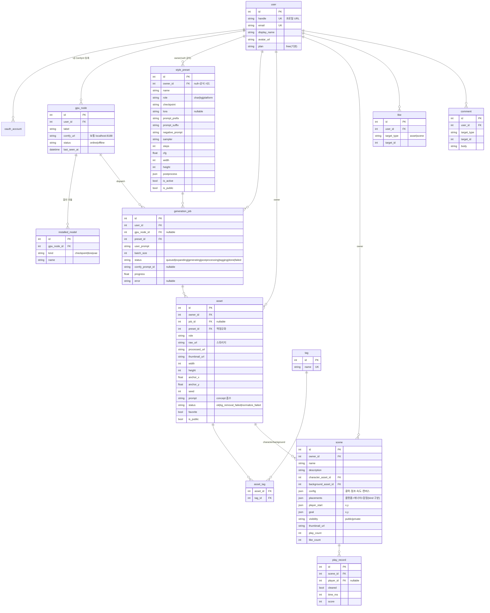

# chchar — DB ERD (서비스 버전 v2)

> 멀티유저 **서비스** 전제 + **생성은 각 사용자의 개인 GPU(로컬 ComfyUI)**.
> 이전 로컬 단일사용자 초안(8테이블)을 대체. 백엔드 = **FastAPI + SQLModel + PostgreSQL**.

## 설계 원칙 (무엇이 어디 사나)

| 데이터 | 사는 곳 | 이유 |
|---|---|---|
| 계정·메타·공유·소셜 | **클라우드 DB** | 가볍고 우리가 보관 |
| 이미지 **생성(GPU)** | **사용자 개인 ComfyUI** | 무겁고 비용 0, 사용자 것 |
| 생성된 **PNG 파일** | **클라우드 스토리지(S3/R2)** | 공유하려면 결과물은 우리가 보관해야 함 |

## 확정 결정
1. GPU 연동 = **브라우저 오케스트레이션** (서비스가 GPU를 직접 안 찌름, 브라우저가 다리)
2. 결과 파일 = **클라우드 스토리지** (DB엔 URL만)
3. 태그 = **별도 테이블** (전역 검색)
4. 결제·플랜 = **MVP 제외**, 나중에
5. 스택 = **FastAPI + SQLModel + PostgreSQL**

## 생성 흐름 (브라우저 오케스트레이션)
```
브라우저(S1 제출) → POST /jobs  (generation_job: queued)
→ 같은 브라우저가 localhost ComfyUI /prompt 호출 + /ws 진행률 → S2 갱신
→ 완성 PNG를 스토리지 업로드 → POST /assets (asset: storage_url) → S3 갤러리
※ 서비스는 GPU 미접근. 헤드리스/폰 트리거가 필요해지면 gpu_node에 로컬 에이전트(폴링) 추가.
```

---

## ER 다이어그램 (MVP 13테이블)



---

## 그룹별 요약

| 그룹 | 테이블 | 역할 |
|---|---|---|
| **계정** | `user`, `oauth_account` | 구글 로그인·프로필 |
| **개인 GPU ★** | `gpu_node`, `installed_model` | 내 ComfyUI 등록 + 깔린 모델(프리셋 호환 검증) |
| **생성** | `style_preset`, `generation_job`, `asset`, `tag`, `asset_tag` | 레시피 → 주문 → 결과(스토리지 URL) → 태그 |
| **레벨** | `scene` | 공유 가능한 씬(placements=JSON, public/private) |
| **소셜** | `like`, `comment`, `play_record` | 좋아요·댓글·플레이 기록 |

→ **MVP 13테이블.** (Django 안 쓰고 FastAPI라 프레임워크 auth 테이블 없음 — user/oauth 직접 관리)

## 로컬 단일사용자 초안 대비 변경점
- `concept` 삭제 → `asset.prompt` 흡수 · `generation_job` 유지(서비스는 이력/쿼터/디스패치 필요)
- 모든 핵심 테이블에 **`owner_id`** 추가 (멀티유저)
- `asset` 파일경로 → **스토리지 URL**(raw/processed/thumbnail_url)
- `scene_platform`/`scene_entity` 삭제 → `scene.placements`(JSON) 통합
- **신규**: `gpu_node`, `installed_model`(개인 GPU), `like`/`comment`/`play_record`(소셜)

## 나중 확장 (MVP 제외)
`plan`/`subscription`(스토리지·공개레벨 한도), `notification`, `report`(신고), `follow`, `collection`(즐겨찾기 묶음), 로컬 에이전트(폰/헤드리스 트리거).

## 좌표 계약 (유지)
S5 배치 = S6 Phaser 월드좌표 1:1 (`frontend/src/lib/coords.ts`). 서버 무관, `scene.placements` 좌표가 그대로 플레이에 쓰임. 실측 통과(지면 y=688 → 발 착지 688).
