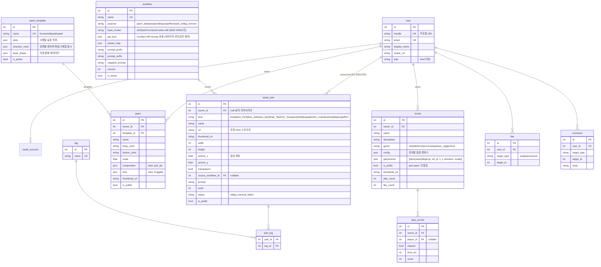

# chchar — DB ERD (서비스 버전 v5 · paper-doll Pawn · WebGPU 추론)

> 멀티유저 **서비스**. 제품 = decal-atlas / paper-doll **Pawn** 시스템(RimWorld·Battle Brothers·
> Wildermyth·Armello 톤). 캐릭터 = 분리된 **투명 파츠(atlas)** 를 타원 몸체에 얹어 조립하고,
> 방향은 **8장 이미지가 아니라 방향별 레이어/좌표/스케일 규칙**으로 표현. 모션은 코드(squash/
> stretch·bobbing·weapon swing). 여러 장르(클릭·디펜스·서바이버·탑다운RPG·전술)에 재사용.
> 백엔드 = **FastAPI + SQLModel + MariaDB**(mysql+pymysql, utf8mb4).

## 역할 분담 (무엇이 어디서)

| 영역 | 위치 | 이유 |
|---|---|---|
| 파츠 **생성(추론)** | **사용자 브라우저 WebGPU** (web-stable-diffusion / transformers.js / onnxruntime-web) | 사용자 GPU 직접 사용. 무설치·즉시·안전(로컬호스트 CSRF 없음). 서버 GPU 비용 0 |
| 워크플로우·모델 메타 | **서버 DB**(`workflow` 테이블) | 운영자가 만든 프리셋(프롬프트 템플릿·LoRA·후처리)을 서버가 배포 |
| 파츠 **조립·방향·애니메이션** | **브라우저** (2D 합성 + 코드) | 가벼움 |
| 계정·라이브러리·메타·소셜 | **클라우드 DB** | 공유용 |
| 파츠/썸네일 **PNG 파일** | **오브젝트 스토리지(S3/R2)** | 결과물은 우리가 보관 |

## 환경 가정 (★ 7차 핵심 제약)
- **타깃 VRAM = 8GB** (일반 사용자, RTX 3060/4060·M1/M2 통합 8GB 기준)
- 베이스 모델 = **SD1.5 / SD1.5-LCM / SDXL-Turbo 양자화** 등 **8GB 안에서 도는 것**만
- **FLUX·SDXL 풀해상도·대형 모델은 제외** (브라우저 WebGPU 한계로 못 돎)
- 그래도 `workflow.api_json`은 ComfyUI API-format 호환 형식으로 받아 두고, 브라우저 런타임이 핵심 노드(model/lora/sampler/post)만 해석·실행

## 확정 결정
1. 생성 = **사용자 브라우저 WebGPU 추론** + **서버는 워크플로우 정의(JSON)·모델 메타만 보관**. 사용자 PC에 ComfyUI 설치 안 시킴, 서버에 GPU도 안 띄움
2. 핵심 3엔티티 = **`asset_part`(파츠 원자) · `pawn`(조립체) · `pawn_template`(방향 규칙)**
3. 방향 = **이미지 8장 아님**, `pawn_template.direction_rules`(JSON)로 레이어/좌표/스케일 표현
4. 결과 파일 = **스토리지**, DB엔 URL만
5. 서버 큐 없음 → 생성 진행상황은 **클라이언트 상태**(generation_job 테이블 폐기)
6. 결제·플랜·크레딧 = **MVP 제외**

## 생성·조립 흐름
```
[생성] 브라우저 → 서버에서 workflow 정의(JSON) + 모델 가중치 URL 받기
   → 가중치 캐시(IndexedDB/Cache API) → 브라우저 WebGPU 파이프라인이 추론(SD1.5 등)
   → 투명화(RMBG WebGPU/ONNX) → 결과 PNG → 서버 업로드(presigned URL → S3/R2)
   → asset_part 행 생성
[조립] 브라우저: pawn_template(슬롯+방향규칙) + asset_part 들 → Pawn 합성
   → 방향(N/NE/E/…)은 direction_rules로, 모션은 코드
[배치] scene.placements 에 pawn/tile/prop 좌표 배치 → 장르별 플레이
```

---

## ER 다이어그램 (MVP 12테이블)



---

## 그룹별 요약

| 그룹 | 테이블 | 역할 |
|---|---|---|
| **계정** | `user`, `oauth_account` | 로그인·프로필 |
| **생성 템플릿** | `workflow` | SD1.5/LCM 등 8GB VRAM용 워크플로우 프리셋(목적별). 서버 보관, 브라우저 WebGPU에서 실행 |
| **파츠 ★** | `asset_part` | 투명 PNG 파츠 원자(slot/kind). owner null=공식 라이브러리 |
| **Pawn ★** | `pawn`, `pawn_template` | 조립 캐릭터 + 방향 규칙("이미지 아니라 규칙") |
| **태깅** | `tag`, `part_tag` | 파츠 전역 검색 |
| **씬** | `scene` | Pawn·타일·prop 배치(장르별 보드/레벨) |
| **소셜** | `like`, `comment`, `play_record` | 좋아요·댓글·플레이 기록 |

→ **MVP 12테이블.** (FastAPI라 프레임워크 auth 테이블 없음 — user/oauth 직접 관리)

## v4(사용자 PC ComfyUI) 대비 v5 변경점
- **DB**: PostgreSQL → **MariaDB**(mysql+pymysql, utf8mb4)
- **추론 위치**: 사용자 PC ComfyUI(설치 필요) → **브라우저 WebGPU**(설치 0)
- **베이스 모델**: FLUX.2 Klein 4B(16GB) → **SD1.5/LCM**(8GB VRAM 한계)
- **workflow.api_json**: ComfyUI가 직접 실행 → ComfyUI API-format 호환 JSON을 **브라우저 런타임이 해석·실행**

## v2(BYO-GPU 플랫포머) 대비 누적 변경점
- **삭제**: `gpu_node`·`installed_model`(로컬 GPU 등록), `generation_job`(서버 큐 없음), `style_preset`·`asset`·`asset_tag`(픽셀 스프라이트 모델)
- **신설**: `workflow`(워크플로우 프리셋), `asset_part`(파츠 원자), `pawn`·`pawn_template`(조립체·방향규칙), `part_tag`
- 제품 = 픽셀 플랫포머 → **paper-doll Pawn**(다장르 토큰). 플랫포머 옆모습은 MVP 제외
- 생성 위치 = (구)브라우저 오케스트레이션·(v3)서버GPU·(v4)사용자ComfyUI → **(v5)브라우저 WebGPU**

## 나중 확장 (MVP 제외)
`plan`/`subscription`·`credit_ledger`, `pawn_animation_clip`(저장 모션), `notification`, `report`, `follow`, `collection`(파츠 묶음/팩).
